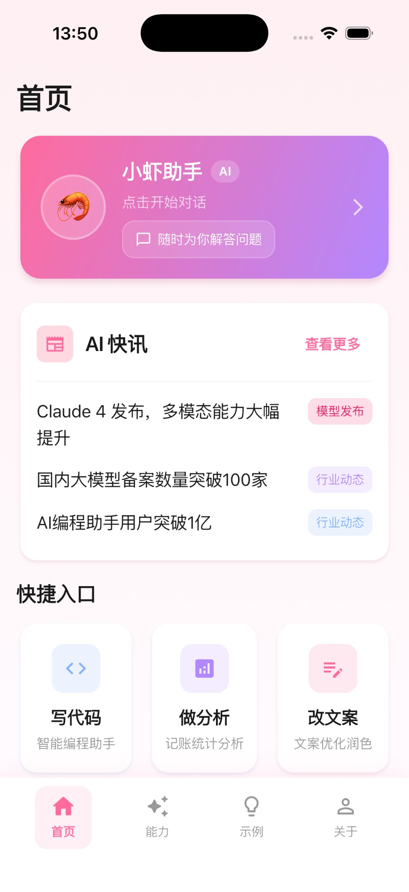
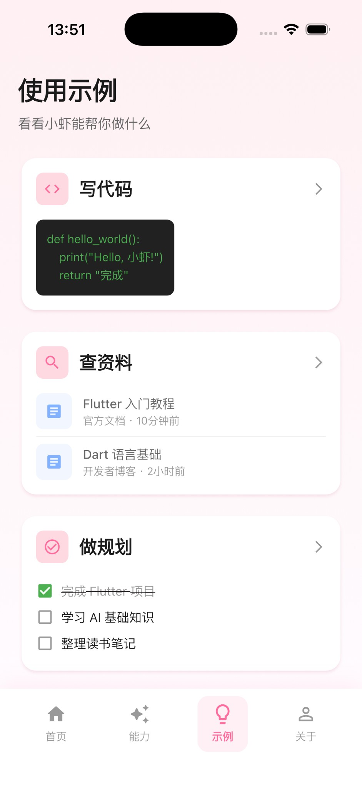
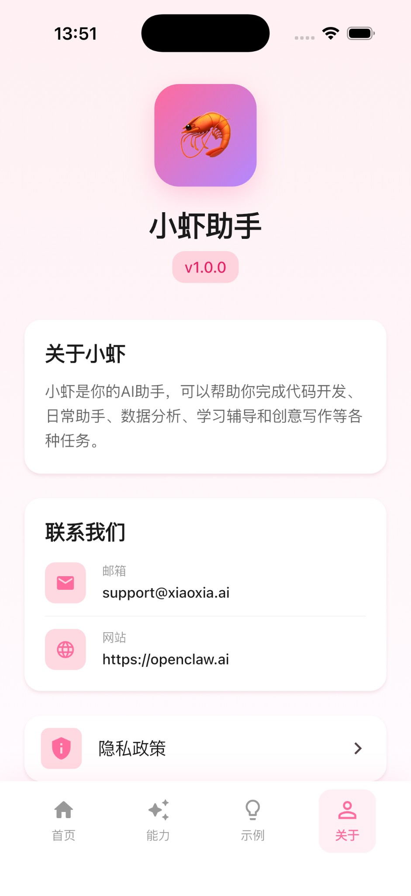

# 小虾助手 (Xiaoxia Assistant)

[](https://flutter.dev)
[](https://dart.dev)
[](LICENSE)

<p align="center">
  
</p>

## 📖 项目背景

**小虾助手** 是一个可爱的 AI 助手应用，诞生于 2026 年 2 月。项目名字来源于开发者对助手的期望——虽然小巧，但能力强大，像小虾米一样灵活多变。

在这个 AI 快速发展的时代，我们希望打造一个**跨平台、功能丰富、界面友好**的智能助手应用，让每个人都能轻松享受到 AI 技术带来的便利。

> 💡 **"小虾不小，助手很强"** —— 这是我们开发这个应用的初心。

---

## ✨ 功能特性

### 🏠 首页功能
- **AI 助手卡片** - 一键进入智能对话界面
- **AI 快讯** - 实时更新 AI 领域最新资讯
- **快捷入口**
  - 💻 写代码 - 智能编程助手
  - 📊 做分析 - 记账统计分析
  - ✏️ 改文案 - 文案优化润色

### 📚 示例模块（8大功能）

| 模块 | 功能描述 | 技术亮点 |
|------|---------|---------|
| 💻 **写代码** | AI 代码生成器，支持 Python/JS/Dart/Java/Swift | 多语言代码模板，一键生成 |
| 🔍 **查资料** | 智能搜索，热门话题 + 历史记录 | 模拟搜索场景，快速查资料 |
| ✅ **做规划** | 任务管理，今日进度 + 长期目标 | 进度追踪，目标管理 |
| 🗣️ **学外语** | 语言学习，对话/单词/进度三合一 | 沉浸式学习体验 |
| 📊 **数据分析** | 数据可视化，图表 + AI 洞察 | 本地图表渲染，数据分析 |
| 🔍 **图像识别** | ML Kit 本地图像识别 | Google ML Kit，离线识别 |
| 📅 **智能日程** | 日历管理，时间轴 + AI 建议 | 时间轴展示，日程管理 |
| 📝 **智能写作** | AI 写作助手，5种风格 + 模板 | 多风格写作，快速创作 |

### 👤 关于页面
- **隐私政策** - 完整的隐私条款说明
- **联系信息** - 邮箱、网站等联系方式
- **版本信息** - 应用版本更新记录

---

## 🛠️ 技术栈

- **框架**: Flutter 3.0+
- **语言**: Dart 3.0+
- **状态管理**: StatefulWidget
- **本地存储**: SharedPreferences / SQLite
- **AI/ML**: Google ML Kit（图像识别）
- **图表**: fl_chart
- **UI 设计**: Material Design 3 + 自定义主题

### 支持平台
- ✅ Android（API 21+）
- ✅ iOS（12.0+）
- ✅ macOS
- ⏳ Web（未来支持）

---

## 📊 开发成本统计

### Kimi AI 使用情况

| 项目 | 数据 |
|------|------|
| **总 Token 消耗** | ~ 450,000 tokens |
| **总费用** | ~ ¥ 15-20 元 |
| **开发时长** | ~ 8 小时 |
| **代码行数** | ~ 23,000 行 |
| **文件数量** | 147 个文件 |

> 💰 **说明**: 实际费用根据 Kimi API 的计费标准和具体使用量可能有所差异。以上数据为估算值。

---

## 🚀 快速开始

### 环境要求
- Flutter SDK 3.0 或更高版本
- Dart SDK 3.0 或更高版本
- Android Studio / Xcode（用于移动端开发）

### 安装步骤

1. **克隆项目**
```bash
git clone https://github.com/CarolLILI/xiaoxia-app.git
cd xiaoxia-app
```

2. **安装依赖**
```bash
flutter pub get
```

3. **运行应用**

Android:
```bash
flutter run
```

iOS:
```bash
cd ios && pod install && cd ..
flutter run
```

### 构建 Release 包

Android:
```bash
flutter build apk --release
```

iOS:
```bash
flutter build ios --release
```

---

## 📱 应用截图

<p align="center">
  
  
  
  
</p>

---

## 🗂️ 项目结构

```
lib/
├── main.dart                 # 应用入口
├── theme.dart               # 主题配置
├── models/                  # 数据模型
│   ├── code_example_model.dart
│   ├── expense_model.dart
│   ├── health_model.dart
│   └── painting_model.dart
├── pages/                   # 页面
│   ├── home_page.dart       # 首页
│   ├── abilities_page.dart  # 能力页面
│   ├── examples_page.dart   # 示例页面
│   ├── about_page.dart      # 关于页面
│   ├── ai_assistant_page.dart
│   ├── copywriting_page.dart
│   ├── examples/            # 示例模块
│   │   ├── code_example_page.dart
│   │   ├── search_example_page.dart
│   │   ├── planning_example_page.dart
│   │   ├── language_example_page.dart
│   │   ├── data_analysis_example_page.dart
│   │   ├── image_recognition_page.dart
│   │   ├── schedule_page.dart
│   │   └── writing_page.dart
│   └── about/               # 关于相关
│       └── privacy_policy_page.dart
└── services/                # 服务层
    ├── code_service.dart
    ├── expense_service.dart
    ├── health_service.dart
    └── painting_service.dart
```

---

## 🤝 贡献指南

欢迎提交 Issue 和 Pull Request！

1. Fork 本仓库
2. 创建你的特性分支 (`git checkout -b feature/AmazingFeature`)
3. 提交你的修改 (`git commit -m 'Add some AmazingFeature'`)
4. 推送到分支 (`git push origin feature/AmazingFeature`)
5. 打开一个 Pull Request

---

## 📄 开源协议

本项目基于 [MIT License](LICENSE) 开源。

---

## 🙏 致谢

- [Flutter](https://flutter.dev/) - 跨平台 UI 框架
- [Google ML Kit](https://developers.google.com/ml-kit) - 移动端机器学习
- [Kimi AI](https://kimi.moonshot.cn/) - AI 开发助手
- [OpenClaw](https://github.com/openclaw/openclaw) - 代理框架

---

## 📮 联系我们

- 📧 邮箱：support@xiaoxia.ai
- 🌐 网站：https://openclaw.ai
- 💬 GitHub Issues：[提交问题](https://github.com/CarolLILI/xiaoxia-app/issues)

---

<p align="center">
  <strong>Made with ❤️ by 小虾团队</strong>
</p>

<p align="center">
  
</p>
